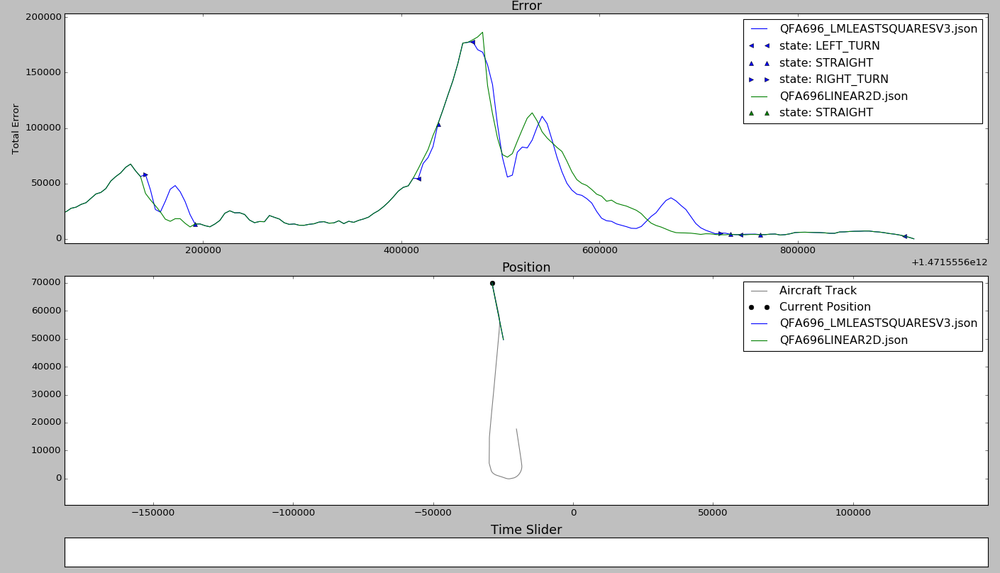
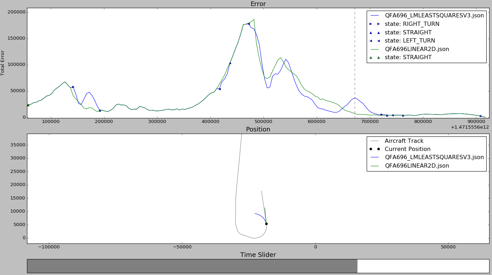

Testing and Analysis
=======================

.. sectionauthor:: Chris Coleman <7191375@student.swin.edu.au> 

Accuracy Testing
---------------------------------------
Part of the aim of this project is to determine whether making and displaying predictions
if of any benefit to Air Traffic Control Operators. As the prediction system will be cramming
the display with more information, we need to be sure that the additional information is
accurate, and as close to true aircraft behavior as possible.

Therefore, we have developed a testing framework that uses testing scenarios to compares the
predicted positional points with their actual data value and, from this information, we can
compare and analyse the effectiveness of each algorithm that we have created.

**Planning**
Before we could start development of the testing features, we needed to decide on a few points:
- In what situations do we intend to test our algorithms,
- How do we measure the error between our predicted and actual positions,
- and how can we compare these errors between algorithms and scenarios.

*Scenarios*
We have decided on a few 'basic' scenarios with which we can test algorithm accuracy:
- Straight and Level - no variations in flight heading, checking distance over time
- Constant Curve - a constant turn rate, checking the most basic of curvilinear ability
- Combination of - mixing straight and level with turning, slightly more realistic behavior

Other possible scenarios that could be considered when greater functionality is added:
* Holding patterns - with known flight paths, can we make predictions more accurately?
* Random flight w/ sharp turns - how algorithms handle rapid changes in trajectory
* Noisy input data - can the system filter out noise/error from the data being input?
* Multiple data sources - testing the ability for the system to combine and use multiple data types

For now, our testing will only involve the three basic scenarios listed above, these will be
generated through extracting data from flight simulation programs.

*Calculating Error*
The simplest, and probably most logical, way to calculate error for our system is the distance
between our predicted and actual positions.
To achieve this, we will be calculating the arc distance between the two points (called
Great-Circle Distance on a sphere). By calculating the arc distance for each point we can begin to see how algorithms handle certain
scenarios and situations.

**Design**
*Final Design*
The final flowplan revolved around having the testing feature act as a listener to the Prediction
Engine and, in a similar fashion to the Display, be notified and sent predictions as they came to be.
By pre-feeding the scenario into the tester, we could calculate and store, in real time, the
errors.

*Final Solution*
Our solution's design involved:
- Receiving, at startup, the scenario being run
- Make a new entry in a HashMap for each plane involved
- Store every time and position combination for each plane
- Create a .json/.txt file named using combined the Prediction Method and Date/Time

and when a prediction was received:
- Take the predictions PlaneID and get the related time/position list
- For each predicted state, find the matching (or boundary) timestamp (or timestamps)
- Get the resulting 'actual' position
- Calculate the arc distance between the predicted and 'actual' positions
- Once the prediction has been fully iterated through, store results in the .json/.txt file

at shutdown:
- Save and close the results file

The solution gave us the freedom to save, copy and edit multiple results documents. If saved as a .txt file, it is quite simple to convert to .csv and analyse results in Excel, using a number of different weighted averages, comparison tools or filtering techniques. This means that people are free to conduct their own analyse as they see fit.
The .json files can be used by a Python script that is able to display two different results documents, showing the full predictions, and allowing us to compare the errors and characteristics of prediction methods. Most of our analysis will be using this tool. 

*Hurdles*
Originally, we intended to simply compare the like timestamps. However, although our predictions
can be made exactly 5 seconds into the future, the input data isn't so perfect and we had
very few matching timestamps between our predicted and actual data streams.
Therefore, we had to revise the design to iterate through the actual data and look for either
matching times - where we could just compare the two positions - or the two bordering times and
attempt to interpolate an 'actual' position from the two points given.

Although not a difficult task to complete, it did throw the design a little and involved a rethink
of how we were going to store scenario data.

**Results Analysis**
As explained above, we planned on using scenarios that involved linear and curved flight to better understand the strengths and weaknesses of our curvilinear predictions, and how they compared to the linear predictions of current ATC Systems. One scenario we obtained was the flight path of QFA696 from the 18th August, 2016. This data contains a large linear section merging into into a curved turned, before straightening back out again.
Plotting its errors with a standard linear prediction showed a few key moments that displayed the strengths of curvilinear prediction(Blue), as well as some drawbacks in relation to linear prediction(Green):

	Fig1. - QFA696 Flight Scenario

*Strengths*
An obvious strength of curvilinear predictions is that they are able to understand, and better predict, when the aircraft is undergoing curved flight. Figure 2 shows the moment when QFA696 is beginning to turn, and the reaction by LMLeastSquares algorithm, while Figure 3 shows the aircraft mid-turn and the differences in errors.

.. figure:: QFA696_2.png
	:align: center
	
	Fig2. - Beginning of a Turn
	
The curvilinear prediction is able to quickly determine, and react to, the beginnings of a turn, resulting in a quick decline in error. More importantly, it is able to better represent the future trajectory of the aircraft, and show users that the aircraft will be entering a turn.

.. figure:: QFA696_3.png
	:align: center

	Fig3. - Mid-turn Prediction

Similarly, during the actual turn, a curved prediction shows a closer representation of the actual path compared to the linear display.

*Weaknesses*
The intelligence of curvilinear predictions also act as a draw back. There is a strong chance of over-predictions, where the algorithm extends curved flight further than what would be normally expected, or reacting to minor path changes.

Figure 4 shows how our curvilinear system overreacts to what is a minor change in flight path, running from one linear section to another, the quick adjustment to heading results in a curved prediction.
This situation would also be prevelant in full ATC systems. When combining information from a number of sources, there is a high likelyhood that the calculated data points would have a slight zig-zag meaning a curvilinear prediction would constantly be trying to adjust for curved paths and reducing its overall effectiveness. 

.. figure:: QFA696_1.png
	:align: center

	Fig4. - Minor heading change

Another situation that works against curvilinear predictions is when an aircraft is leaving a turn. Algorithms will expect the curved path to continue, which can mean situations like Figure 5 will occur:

	
	Fig5. - Exiting a Turn
	
As the previous points all lead to a curved trajectory, our algorithm continues that same path. Whereas the linear algorithm, being less intelligent, is lucky to correctly assume that the aircraft will just fly straight from its current heading.
This spike of error will occur every time an aircraft leaves a turn.