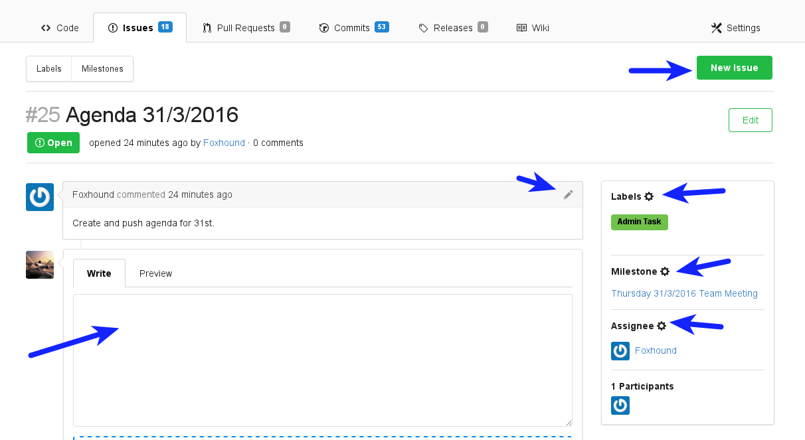
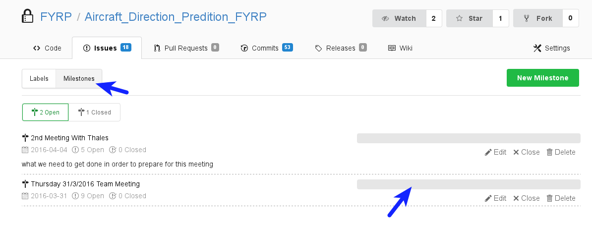

# How to use Gogs

_Section author: Luke Frisken <[l.frisken@gmail.com](mailto:l.frisken@gmail.com)>_

## Issue tracking for project managment

### Introduction

Gogs issue tracker can be used as a project managment tool.

**IMPORTANT!**
> First, it is recommended that you "watch" the project to receive updates via email.

To access the list of issues associated with a project, click on the issues tab.

### New/Edit Issue

Creating a new issue is done with the *"New Issue"* button.
You can edit text using markdown format. See github's great documentation on the markdown format [here](http://www.markdowntutorial.com/) and their tutorial [here](http://www.markdowntutorial.com/) for more information.

* You can assign labels to an issue, which help with filtering the issues in the issue list.
* You can assign this issue to a Milestone (more on that later).
* You can assign a person (*"Assignee"*) to be responsible for the issue.

### Filter Issues

To see which issues are assigned to someone, click on *"assignee"*, and the name of the person. You can also see the issues assigned to you under the *"type"* filter.

-------------------------------------------------

To see the issues which are currently unassigned:

### Labels

Labels can be assigned to issues to aid in sorting and filtering. Click on the *"Labels"* button to see the list of available labels. Click on the *"open issues"* link to see a list of open issues which have been tagged with that label.

### Milestones

Milestones represent a goal for the project which you are working towards. Milestones can have a due date set, and issues can be assigned to a particular Milestone. Milestones also have a progress bar, indicating the percentage of issues assigned to it which have been closed/completed.

