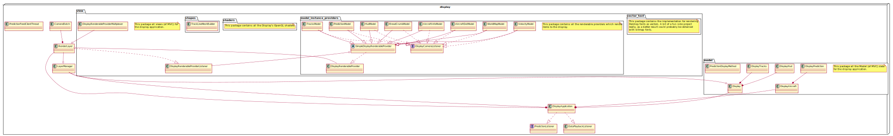
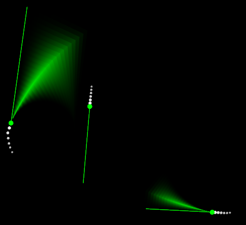
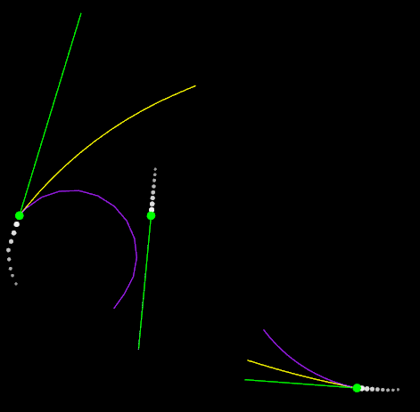
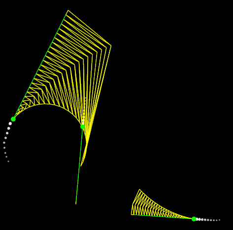

Display
==========

.. sectionauthor:: Luke Frisken <l.frisken@gmail.com>

The :java:extdoc:`com.atc.simulator.display` package contains all the display
functionality for this application.

.. java:package:: com.atc.simulator.display
	:noindex:

.. rubric:: Diagrams

	Class Design

Overall Design
---------------

The display is designed to be a high performance opengl application.
It achieves this aim by using libgdx's models api to create instances
of the draw geometry to get stored in the gpu vertex buffers. The main problem
of this method is that managing, and updating the resources can be expensive
and a bit complicated. Currently :java:extdoc:`view.DisplayRenderableProvider` objects
are used to store the state of geometric object, to update it, and to render it.

Display Methods
---------------

Of primary interest is the :java:extdoc:`view.model_instance_providers.PredictionModel`
class which contains the code for displaying the predictions. The different
types of available display methods are enumerated in :java:extdoc:`model.PredictionDisplayMethod`

GRADIENT
~~~~~~~~~

The current most advanced display method is the *GRADIENT* method. This method
creates a mesh between the Right, Centre and Left tracks, and UV maps the
vertices to a generated gradient texture.

	GRADIENT display method

Unfortunately there is a problem with the texture interpolation being incorrect
for trapezoid shapes. This will probably require adding an extra dimension to the
UV map coordinates in order to do perspective correct texture projection.
Unfortunately this also probably means changing the underlying libgdx framework
which is not a small task, so this problem has been sidelined.

TWO_LINE
~~~~~~~~~

	TWO_LINE display method

WIREFRAME
~~~~~~~~~~

	WIREFRAME display method
