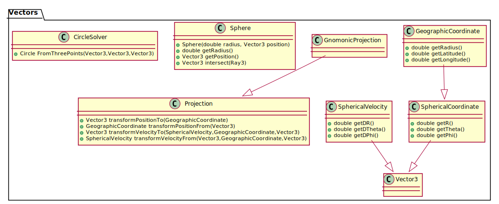

Vectors Package
==========================

.. sectionauthor:: Luke Frisken <l.frisken@gmail.com>

.. rubric:: Introduction

The :java:extdoc:`com.atc.simulator.vectors`
package consists of various important base types used to represent and
manipulate the vector data in this project which are not already supplied
by the libraries it depends on.

.. rubric:: Diagrams

	Class Design

.. rubric:: Table of Contents

.. toctree::
   :maxdepth: 1

   Projection/Projections
   Spherical_Coordinate_System/Spherical_Coordinate_System
