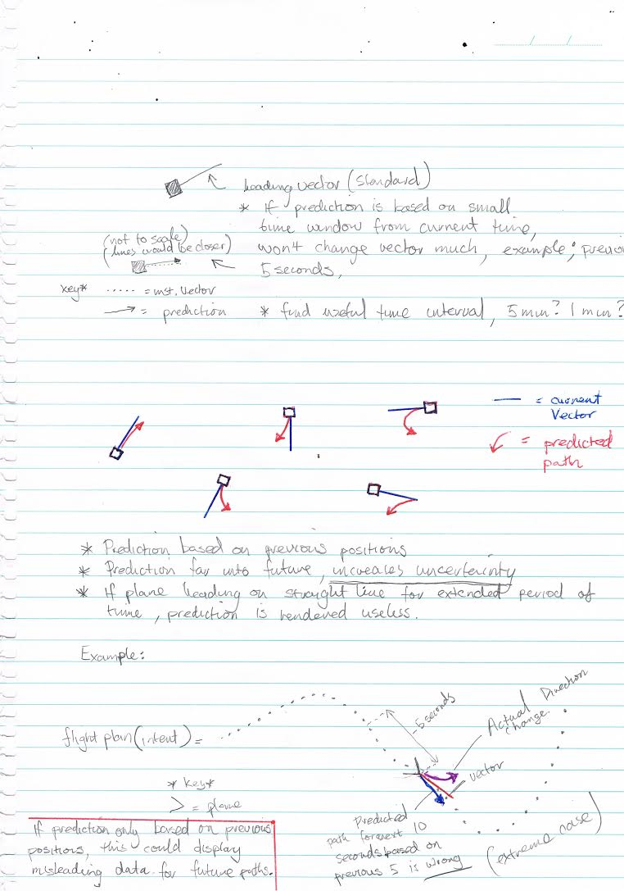

Display Design
==============

.. sectionauthor:: Uros Vukanovic <7671725@student.swin.edu.au>

Initial Ideas about Visualizations
----------------------------------

After the Initial discussion with client about the problem, some basic
visualization ideas on how to present the prediction data to the traffic
controllers was composed.

    Fig1. - Preliminary ideas about how to visualize the solution.

.. figure:: ./design2.jpg
    :target: ../../../_images/design2.jpg

    Fig2. - In Depth Sketches on how to visualize the prediction paths

Design Considerations
---------------------

Feedback at a later date showed us the importance and delicacy of
presenting the prediction data visually. Being an ATC controller you
don’t want your screen to be overly cluttered. This adds to the problem
of presenting something useful, while also providing something that
won’t distract the controllers from their job. Currently ATC screens are
quite simple and only show what is absolutely required.

Another point client stressed is that the visualization has to be
presented in a way that doesn’t affirm to the controller that this is
the definitive path the plane will be headed on, simply a prediction of
possible future positions. This can be demonstrated in the figure below.
Having arrows coming out of the predicted paths was something client
suggested might confuse ATC controllers.

.. figure:: ./ATCscreen1.jpg
    :target: ../../../_images/ATCscreen1.jpg

    Fig4. - Predictions shown in Red

Design prototypes
-----------------

After taking into account the design considerations several ideas were
sketched out on how to possibly display the prediction.

.. figure:: ./display_methods.jpg
    
    Fig5. - Possible display solutions presented to client

.. figure:: ./display_methods2.jpg

    Fig6. - More Designs

After some discussion with client, they suggested that displaying the
prediction as a shaded area might be the best design approach. This
would re-affirm to the ATC controllers that this was only a possible
location, not a definitive location or direction of the aircraft.

Displaying a shaded area will also provide information on where the
plane will most likely be, while also providing other possible
locations. This, combined with the ATC controller’s cognitive abilities
should be able to assist them make informed decisions about future
positions.

.. figure:: ./display_methods3.png
    :target: ../../../_images/display_methods3.png

    Fig7. - Possible solution for visualization display.

.. figure:: ./ourdisplay.png

    Fig8. - Our Current Implementation of the display for the prediction algorithms.

Figure 8, Shows a tweaked model of figure 7, it uses a shaded area
along with a gradient to try show where the plane will be most likely
depending on the opacity of the shaded area. This is our current and
final implementation of the display visualization.

