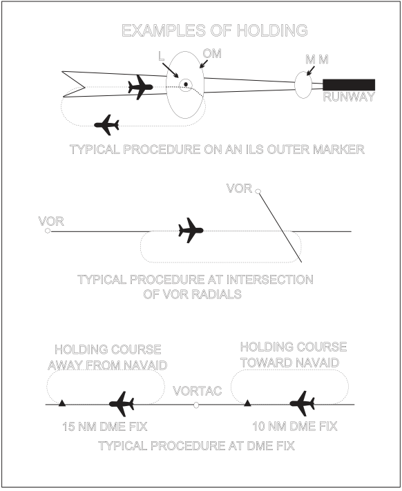
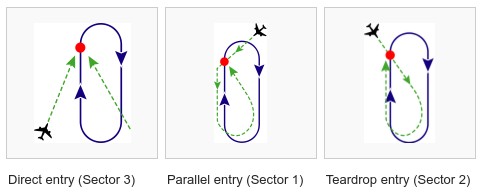
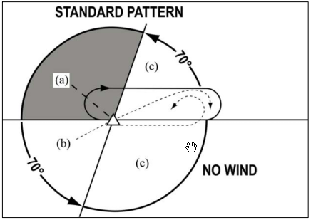

Flight Path Characteristics
=====================================

.. sectionauthor:: Luke Frisken <l.frisken@gmail.com>

.. contents:: Table of Contents
  :depth: 3

Standard Rate Turn
----------------------
According to the FAA Aeronautical Information Manual :cite:`AIM2015`, a standard
rate turn is defined as:

  A turn of three degrees per second

From this information, and the airspeed of the aircraft, a number of parameters
can be derived for an aircraft undergoing a turn as descussed by Luiz Monteiro
:cite:`Monteiro`. As a side node, the following parameters ignore slip,
and are therefore at least marginally inaccurate.

Turn Radius
^^^^^^^^^^^^^^^^^^^^

:math:`v = Velocity`

:math:`\omega = AngularVelocity`

:math:`r = TurnRadius`

:math:`r = \frac{v}{\omega}`

For a standard rate turn, the Angular Velocity is:

:math:`\omega = \frac{d\phi}{dt} = \frac{3^{\circ} \times \frac{\pi}{180^{\circ}}}{1}`

:math:`\omega = \frac{\pi}{60}`

Therefore the turn radius for a standard rate turn would be:

:math:`r = \frac{v * 60}{\pi}`

Bank Angle
^^^^^^^^^^^^^^^^^^^^
:math:`\alpha = tan^{-1}(\frac{v^2}{g \times r})` :cite:`Monteiro`

Holding Patterns
------------------------

Holding patterns are planned flight paths involving a series of turns which are
designed to keep an aircraft at a certain location.

Some Example Situations from AIM:

  Holding Patterns :cite:`AIM2015`

.. figure:: Holding_Pattern_2.png
  :align: center

  Holding Pattern Terms :cite:`AIM2015`

Below 14,000 feet, both the inbound and outbound legs are supposed to take
1 minute. Above 14,000 feet this increases to 1.5 minutes. :cite:`AIM2015`

Turns during a holding pattern are typically at a standard rate and have a
maximum bank angle of 30 degrees. :cite:`AIM2015`

Pattern Entry
^^^^^^^^^^^^^^^^^^^^
The choice of entry procedure into a holding pattern is determined by the
relative aproach direction to the direction of the hold.

  Entry Procedures :cite:`HoldingWikipedia`

  Entry Procedures :cite:`AIM2015`

Adhering to Airways or Routes
------------------------------

The FAA is expecting pilots to take actions necessary to remain within route
boundary. This could take the form of leading turns. :cite:`AIM2015`

.. figure:: Adhering_To_Routes.png
  :align: center

  Adhering to Airways or Routes :cite:`AIM2015`

Bibliography
-------------------------

.. bibliography:: /references/SoftwareFinalYear.bib
  :style: unsrtalpha
  :filter: docname in docnames
