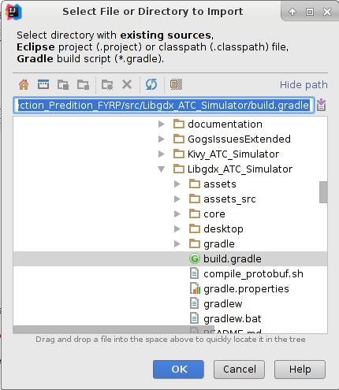
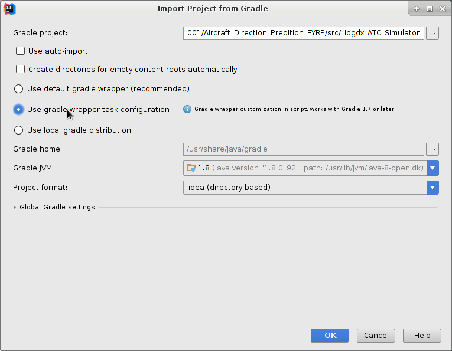
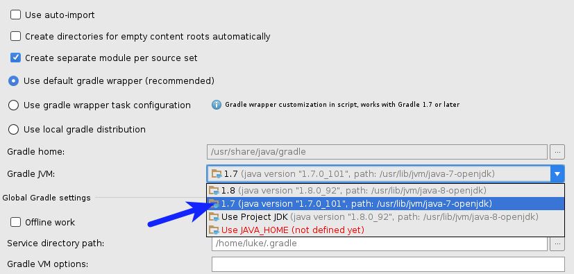
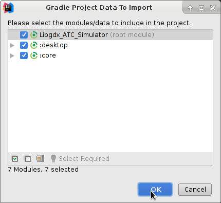
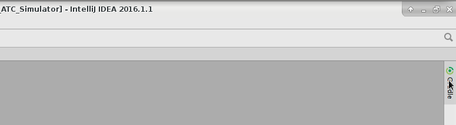
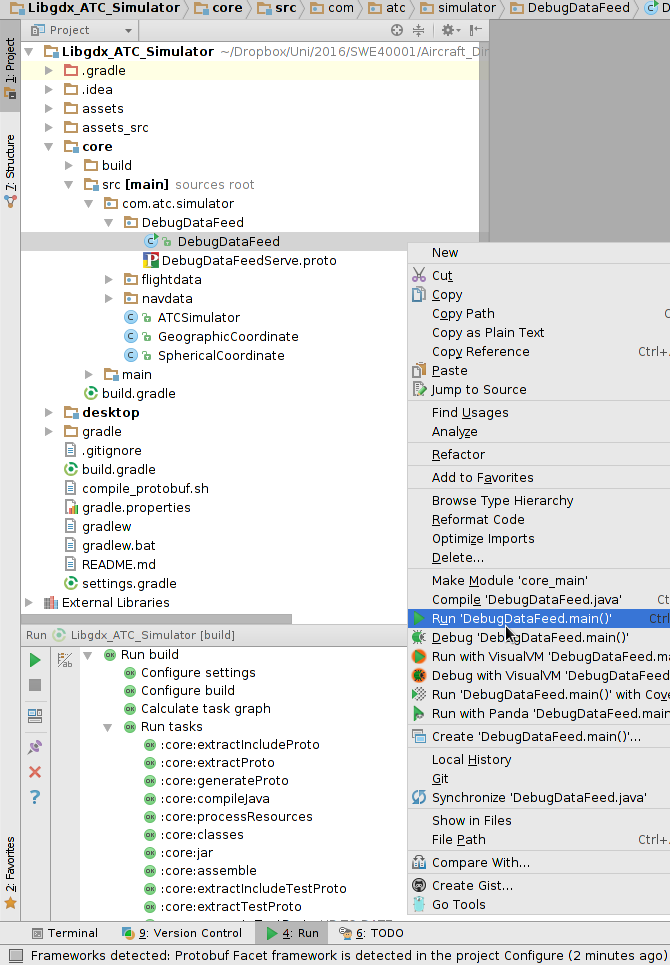
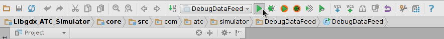
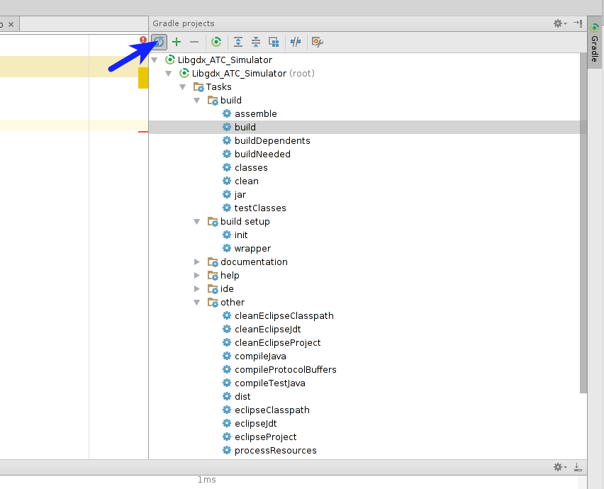
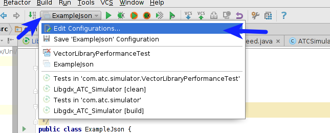
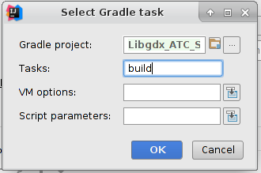

IntelliJ Project Setup
=======================

.. sectionauthor:: Luke Frisken <l.frisken@gmail.com>

This document explains to set up IntelliJ with this project.

.. figure:: Project_Setup_1.png
  :align: center

  Import project

  Choose Gradle build file to import from

  Choose *use gradle wrapper task configuration*

  Choose *Choose Gradle JVM Version 1.7*

  Press OK

.. figure:: Project_Setup_5.png
  :align: center

  Add this repo to IntelliJ

  Click on gradle sidebar (or open it under *view->tool windows->gradle*)

.. figure:: Project_Setup_7.png
  :align: center

  Build the project (double click)

.. figure:: Project_Setup_8.png
  :align: center

  See generated class files from protobuf

  Run main file first time by right click

  After this it is available on toolbar menu

Refreshing Project after Gradle Changes
---------------------------------------

Sometimes after adding new gradle dependencies or changes to the gradle file
you will need to refresh the project to solve problems. This can be done
using the following method:

  click to refresh the gradle project.

Running main Method Files
--------------------------

This describes how to set up IntelliJ to run a file with a main method, and
set it up so that it is automatically rebuilt upon launch.

.. figure:: Project_Setup_17.png
  :align: center

  Right click on file with main method and click run. This will generate
  a new run configuration which we can edit.

  Select the run configuration from the dropdown list and edit.

.. figure:: Project_Setup_13.png
  :align: center

  Delete any existing "Make" tasks to run before launch

.. figure:: Project_Setup_14.png
  :align: center

  Add a new run gradle task

.. figure:: Project_Setup_15.png
  :align: center

  Select the current gradle project this run file is in.

  Select the "build" task
